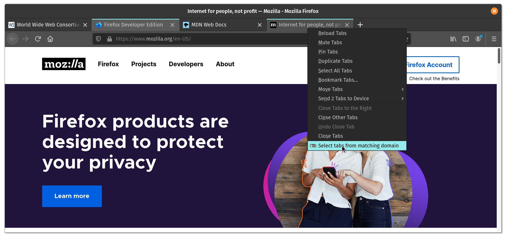

#  Select By Domain

Select By Domain is a single purpose addon that selects all tabs in the same
window that has a matching scheme and host to the clicked one.

This will then allow for native browser options to be quickly applied to the
collection of tabs. Such as moving them all at once, popping them out to a new
window, bookmarking them, or closing them.

It is currently somewhat usable with ESR versions of Firefox, but this is not
guaranteed. Atleast one bug exists for non-HTTP tabs in ESR version 68.

## Screenshots

Context menu to select all tabs from the same domain.



## Code Style

This extension follows the [JavaScript Standard Style][]. I apologise if you
love semicolons. Make sure to run it under the WebExtensions environment:

```
standard --env webextensions
```

For further checking the validity of the codebase, make sure to have it linted
as a browser extension as well:

```
web-ext lint
```

## Licenses

* Everything is released under the BSD Zero Clause License (0BSD). Please see
  the [`LICENSE`](LICENSE) file for more information.

[JavaScript Standard Style]: https://standardjs.com/
